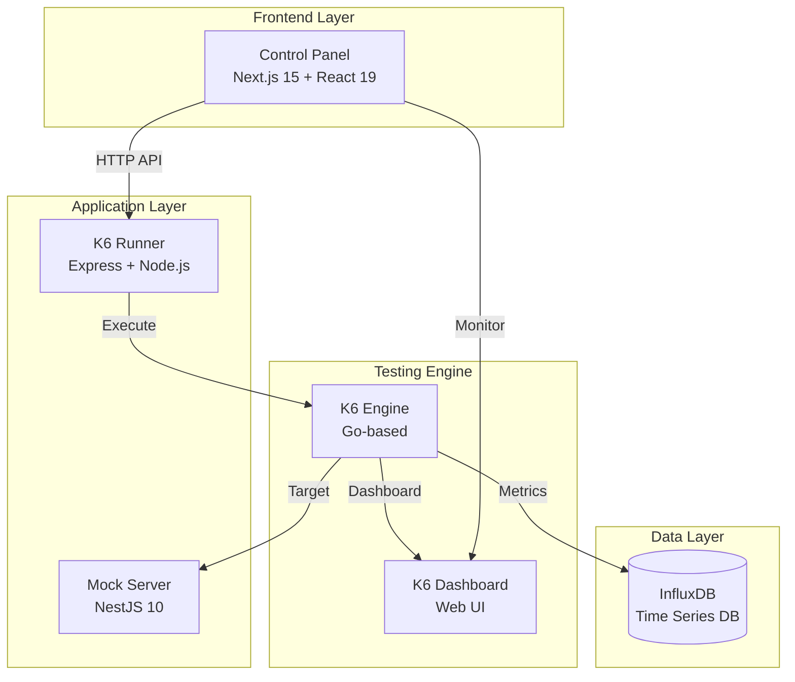
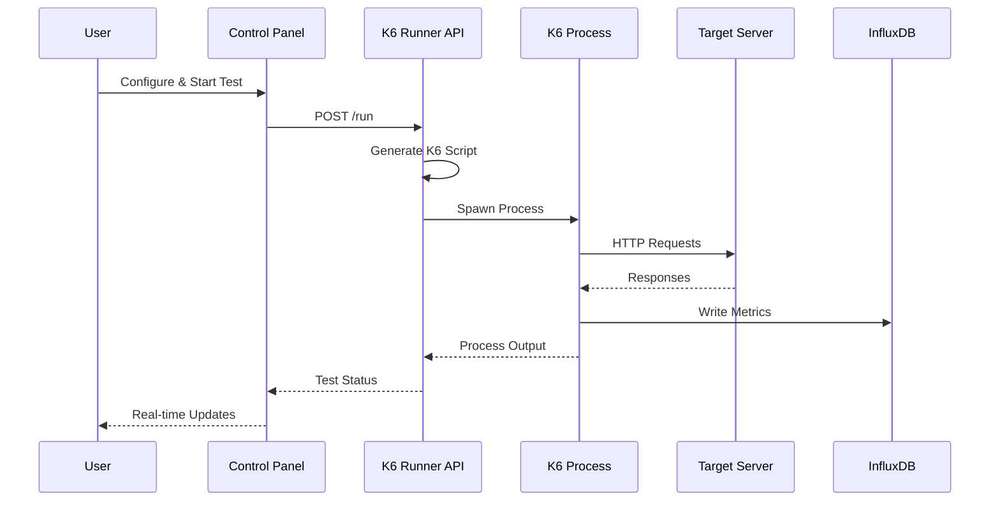
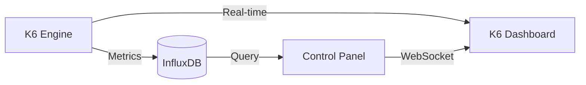

---
tags:
  - k6
  - testing
  - architecture
  - microservices
  - performance-testing
created: 2025-08-13
updated: 2025-08-13
aliases:
  - K6 테스팅 플랫폼
  - 부하 테스트 시스템
description: K6 Testing Platform의 상세 아키텍처 및 코드 동작 원리
status: published
category: guide
author: Claude Code
version: 1.0.0
---

# K6 Testing Platform - 시스템 아키텍처 및 동작 원리

> [!info] 개요
> K6 Testing Platform은 마이크로서비스 기반의 부하 테스트 플랫폼으로, 웹 UI를 통해 K6 테스트를 제어하고 실시간으로 메트릭을 모니터링할 수 있는 통합 솔루션입니다.

## 📑 목차

- [[#🏗️ 시스템 아키텍처]]
- [[#⚡ 테스트 실행 플로우]]
- [[#🎯 핵심 컴포넌트 상세]]
- [[#💡 중앙 시나리오 관리 시스템]]
- [[#🔄 서비스 간 통신]]
- [[#📊 데이터 플로우]]
- [[#🛠️ 기술적 구현 상세]]

---

## 🏗️ 시스템 아키텍처

### 전체 시스템 구조도



### 컴포넌트 책임 분리

| 컴포넌트 | 책임 | 핵심 기술 |
|---------|------|----------|
| **Control Panel** | 사용자 인터페이스, 테스트 설정 | Next.js, TypeScript |
| **K6 Runner** | K6 프로세스 관리, 스크립트 생성 | Express, Child Process |
| **Mock Server** | 테스트 타겟 제공 | NestJS, TypeScript |
| **InfluxDB** | 메트릭 저장 및 쿼리 | Time Series Database |

---

## ⚡ 테스트 실행 플로우

### 테스트 시작 시퀀스

> [!example] 전체 실행 플로우
> 사용자가 "Start Test" 버튼을 클릭하면 다음과 같은 시퀀스로 테스트가 실행됩니다.



### 1️⃣ Control Panel - 테스트 설정 단계

```typescript
// apps/control-panel/components/TestController.tsx

const handleStartTest = async () => {
  // 1. 사용자 설정 수집
  const testConfig = {
    scenario: config.scenario,        // 시나리오 타입 (smoke, load, stress 등)
    vus: config.vus,                  // Virtual Users 수
    duration: config.duration,        // 테스트 기간
    executionMode: config.executionMode,
    
    // 타겟 서버 설정
    useCustomEndpoint: config.useCustomEndpoint,
    targetUrl: config.useCustomEndpoint 
      ? config.customUrl 
      : "http://mock-server:3001",
    urlPath: config.useCustomEndpoint 
      ? config.customPath 
      : config.endpoint,
    httpMethod: config.httpMethod,
    requestBody: config.requestBody,
  };

  // 2. K6 Runner API 호출
  const response = await fetch("/api/k6/run", {
    method: "POST",
    headers: { "Content-Type": "application/json" },
    body: JSON.stringify(testConfig),
  });
};
```

### 2️⃣ API Route - 요청 전달

```typescript
// apps/control-panel/app/api/k6/run/route.ts

export async function POST(request: Request) {
  const body = await request.json();
  
  // K6 Runner 서비스로 전달
  const response = await fetch("http://k6-runner:3002/run", {
    method: "POST",
    headers: { "Content-Type": "application/json" },
    body: JSON.stringify(body),
  });
  
  return Response.json(await response.json());
}
```

### 3️⃣ K6 Runner - 스크립트 생성 및 실행

> [!note] K6 스크립트 동적 생성
> K6 Runner는 사용자 설정을 기반으로 K6 스크립트를 동적으로 생성합니다.

```javascript
// apps/k6-runner/index.js

app.post("/run", async (req, res) => {
  const {
    scenario, vus, duration, iterations,
    targetUrl, urlPath, httpMethod, requestBody
  } = req.body;

  // 1. 시나리오 설정 가져오기
  const scenarioConfig = SCENARIO_CONFIGS[scenario];
  
  // 2. K6 스크립트 생성
  const k6Script = generateK6Script({
    scenario: scenarioConfig,
    vus, duration, iterations,
    targetUrl, urlPath, httpMethod, requestBody
  });
  
  // 3. 임시 파일로 저장
  const scriptPath = `/tmp/k6-test-${Date.now()}.js`;
  fs.writeFileSync(scriptPath, k6Script);
  
  // 4. K6 프로세스 실행
  const k6Process = spawn("k6", [
    "run",
    "--out", "influxdb=http://influxdb:8086/k6",
    enableDashboard && "--out", "web-dashboard",
    scriptPath
  ]);
  
  // 5. 프로세스 상태 관리
  runningProcesses.set(processId, {
    process: k6Process,
    startTime: Date.now(),
    config: req.body
  });
});
```

### 4️⃣ K6 스크립트 생성 로직

```javascript
// apps/k6-runner/index.js - generateK6Script 함수

function generateK6Script(config) {
  const { scenario, vus, duration, targetUrl, urlPath, httpMethod, requestBody } = config;
  
  // HTTP 메서드별 요청 생성
  let httpRequest;
  const fullUrl = `${targetUrl}${urlPath}`;
  
  if (["POST", "PUT", "PATCH"].includes(httpMethod)) {
    // Body가 있는 요청
    const escapedBody = requestBody
      .replace(/\\/g, '\\\\')
      .replace(/`/g, '\\`')
      .replace(/\$/g, '\\$');
    
    httpRequest = `http.${httpMethod.toLowerCase()}('${fullUrl}', \`${escapedBody}\`, params)`;
  } else {
    // Body가 없는 요청 (GET, DELETE)
    httpRequest = `http.${httpMethod.toLowerCase()}('${fullUrl}', params)`;
  }
  
  // 상태 코드 검증 (메서드별로 다름)
  const statusCheck = generateStatusCheck(httpMethod);
  
  return `
    import http from 'k6/http';
    import { check, sleep } from 'k6';
    
    export let options = ${JSON.stringify(scenario.options)};
    
    export default function() {
      const params = {
        headers: { 'Content-Type': 'application/json' }
      };
      
      const res = ${httpRequest};
      
      ${statusCheck}
      
      sleep(1);
    }
  `;
}
```

---

## 🎯 핵심 컴포넌트 상세

### Control Panel 구조

> [!info] Next.js 15 App Router 기반
> 최신 React Server Components와 TypeScript를 활용한 모던 웹 애플리케이션

```typescript
// 주요 컴포넌트 구조
apps/control-panel/
├── app/
│   ├── api/k6/          # API Routes
│   │   ├── run/
│   │   ├── stop/
│   │   └── status/
│   ├── layout.tsx
│   └── page.tsx
├── components/
│   ├── TestController.tsx    # 테스트 설정 UI
│   ├── MetricsDisplay.tsx    # 메트릭 표시
│   └── ScenarioSelector.tsx  # 시나리오 선택
└── lib/
    └── scenario.ts           # 중앙 시나리오 설정
```

### Mock Server 엔드포인트

```typescript
// apps/mock-server/src/success/success.controller.ts

@Controller('success')
export class SuccessController {
  @Get()
  async getSuccess() {
    return {
      statusCode: 200,
      error: false,
      message: 'get success',
      timestamp: new Date()
    };
  }
  
  @Post()
  async postSuccess(@Body() body: any) {
    console.log('Received body:', body);
    return {
      statusCode: 201,  // POST는 201 Created 반환
      error: false,
      message: 'post success',
      timestamp: new Date()
    };
  }
}

// apps/mock-server/src/performance/performance.controller.ts

@Controller('performance')
export class PerformanceController {
  @Get('/slow')
  async getSlow(@Query('delay') delay?: number) {
    const actualDelay = delay || 3000;
    await new Promise(resolve => setTimeout(resolve, actualDelay));
    return {
      statusCode: 200,
      message: `Responded after ${actualDelay}ms delay`
    };
  }
  
  @Get('/variable-latency')
  async getVariableLatency(
    @Query('min') min?: number,
    @Query('max') max?: number
  ) {
    const minDelay = min || 100;
    const maxDelay = max || 1000;
    const delay = Math.random() * (maxDelay - minDelay) + minDelay;
    await new Promise(resolve => setTimeout(resolve, delay));
    return {
      statusCode: 200,
      message: `Variable latency: ${Math.round(delay)}ms`
    };
  }
}
```

---

## 💡 중앙 시나리오 관리 시스템

### Single Source of Truth

> [!tip] 중앙 집중식 시나리오 관리
> 모든 시나리오 설정이 한 곳에서 관리되어 일관성과 유지보수성이 향상됩니다.

```typescript
// apps/control-panel/lib/scenario.ts

export interface ScenarioMetadata {
  id: ScenarioId;
  name: string;
  description: string;
  defaultVus: number;
  defaultDuration: string;
  defaultIterations?: number;
  supportedModes: ExecutionModes;
  rampPattern?: 'none' | 'standard' | 'aggressive' | 'gradual';
  useStages?: boolean;
}

export const SCENARIOS: Record<ScenarioId, ScenarioMetadata> = {
  smoke: {
    id: 'smoke',
    name: '🚬 Smoke Test',
    description: 'Minimal load to verify system works correctly',
    defaultVus: 1,
    defaultDuration: '1m',
    defaultIterations: 10,
    supportedModes: {
      duration: { enabled: true, label: 'Time-based' },
      iterations: { enabled: true, label: 'Count-based' },
      hybrid: { enabled: true, label: 'Combined' }
    },
    rampPattern: 'none'
  },
  load: {
    id: 'load',
    name: '📊 Load Test',
    description: 'Simulate normal expected load',
    defaultVus: 20,
    defaultDuration: '5m',
    supportedModes: {
      duration: { enabled: true, label: 'Time-based' },
      iterations: { enabled: false },
      hybrid: { enabled: true, label: 'Combined' }
    },
    rampPattern: 'standard',
    useStages: true
  },
  stress: {
    id: 'stress',
    name: '💪 Stress Test',
    description: 'Push system beyond normal capacity',
    defaultVus: 50,
    defaultDuration: '10m',
    supportedModes: {
      duration: { enabled: true, label: 'Time-based only' },
      iterations: { enabled: false },
      hybrid: { enabled: false }
    },
    rampPattern: 'gradual',
    useStages: true
  }
};
```

### JavaScript 버전 (K6 Runner용)

```javascript
// apps/k6-runner/scenario-config.js

const SCENARIO_CONFIGS = {
  smoke: {
    options: {
      vus: 1,
      duration: '1m',
      thresholds: {
        http_req_duration: ['p(99)<1500'],
        http_req_failed: ['rate<0.1']
      }
    }
  },
  load: {
    options: {
      stages: [
        { duration: '2m', target: 20 },
        { duration: '5m', target: 20 },
        { duration: '2m', target: 0 }
      ],
      thresholds: {
        http_req_duration: ['p(95)<500', 'p(99)<1000'],
        http_req_failed: ['rate<0.1']
      }
    }
  },
  stress: {
    options: {
      stages: [
        { duration: '2m', target: 50 },
        { duration: '5m', target: 50 },
        { duration: '2m', target: 100 },
        { duration: '5m', target: 100 },
        { duration: '2m', target: 0 }
      ],
      thresholds: {
        http_req_duration: ['p(95)<1000', 'p(99)<2000'],
        http_req_failed: ['rate<0.2']
      }
    }
  }
};
```

---

## 🔄 서비스 간 통신

### Docker 네트워크 구성

> [!note] Bridge 네트워크
> 모든 서비스는 `k6-network` 브리지 네트워크를 통해 통신합니다.

```yaml
# docker-compose.yml

networks:
  k6-network:
    driver: bridge

services:
  control-panel:
    networks:
      - k6-network
    extra_hosts:
      - "host.docker.internal:host-gateway"
  
  mock-server:
    networks:
      - k6-network
  
  k6-runner:
    networks:
      - k6-network
    extra_hosts:
      - "host.docker.internal:host-gateway"
```

### 서비스 디스커버리

```javascript
// 내부 서비스 간 통신
const INTERNAL_URLS = {
  mockServer: 'http://mock-server:3001',
  k6Runner: 'http://k6-runner:3002',
  influxDB: 'http://influxdb:8086'
};

// 외부 접근 (브라우저에서)
const EXTERNAL_URLS = {
  controlPanel: 'http://localhost:3000',
  mockServer: 'http://localhost:3001',
  k6Dashboard: 'http://localhost:5665'
};
```

---

## 📊 데이터 플로우

### 메트릭 수집 및 저장



### K6 메트릭 구조

```javascript
// K6가 InfluxDB에 저장하는 메트릭
{
  measurement: "http_req_duration",
  tags: {
    scenario: "load",
    status: "200",
    method: "GET",
    url: "http://mock-server:3001/success"
  },
  fields: {
    value: 125.45  // milliseconds
  },
  timestamp: 1736764800000000000  // nanoseconds
}
```

### 실시간 모니터링

```typescript
// K6 Web Dashboard 접근
// 테스트 실행 중 http://localhost:5665 에서 실시간 모니터링

interface K6Metrics {
  http_reqs: number;           // 총 요청 수
  http_req_duration: {
    p50: number;  // 중간값
    p90: number;  // 90 백분위
    p95: number;  // 95 백분위
    p99: number;  // 99 백분위
  };
  http_req_failed: number;     // 실패율 (%)
  vus: number;                 // 현재 활성 VU
  data_received: number;        // 수신 데이터 (bytes)
  data_sent: number;           // 송신 데이터 (bytes)
}
```

---

## 🛠️ 기술적 구현 상세

### HTTP 메서드별 상태 코드 검증

> [!warning] 메서드별 성공 기준
> 각 HTTP 메서드는 서로 다른 성공 상태 코드를 가집니다.

```javascript
// apps/k6-runner/index.js

function generateStatusCheck(httpMethod) {
  switch(httpMethod) {
    case 'POST':
      return `
        check(res, {
          'status is successful': (r) => r.status === 200 || r.status === 201
        });
      `;
    case 'PUT':
    case 'PATCH':
      return `
        check(res, {
          'status is successful': (r) => r.status === 200 || r.status === 204
        });
      `;
    case 'DELETE':
      return `
        check(res, {
          'status is successful': (r) => r.status === 200 || r.status === 202 || r.status === 204
        });
      `;
    default: // GET
      return `
        check(res, {
          'status is 200': (r) => r.status === 200
        });
      `;
  }
}
```

### 동적 시나리오 설정

```javascript
// 실행 모드에 따른 K6 옵션 생성
function buildK6Options(scenario, vus, duration, iterations, executionMode) {
  const baseOptions = { ...SCENARIO_CONFIGS[scenario].options };
  
  switch(executionMode) {
    case 'duration':
      // 시간 기반 실행
      if (baseOptions.stages) {
        // Stage 기반 시나리오는 target VU 조정
        baseOptions.stages = baseOptions.stages.map(stage => ({
          ...stage,
          target: Math.round(stage.target * (vus / 20))
        }));
      } else {
        baseOptions.vus = vus;
        baseOptions.duration = duration;
      }
      break;
      
    case 'iterations':
      // 반복 횟수 기반
      baseOptions.vus = vus;
      baseOptions.iterations = iterations;
      delete baseOptions.duration;
      delete baseOptions.stages;
      break;
      
    case 'hybrid':
      // 시간 + 반복 혼합
      baseOptions.vus = vus;
      baseOptions.duration = duration;
      baseOptions.iterations = iterations;
      break;
  }
  
  return baseOptions;
}
```

### 프로세스 생명주기 관리

```javascript
// K6 프로세스 관리
const runningProcesses = new Map();

// 프로세스 시작
function startK6Process(config) {
  const processId = `k6-${Date.now()}`;
  const k6Process = spawn('k6', ['run', ...args]);
  
  // 출력 스트림 처리
  k6Process.stdout.on('data', (data) => {
    console.log(`K6 Output: ${data}`);
    // WebSocket으로 실시간 전송 가능
  });
  
  k6Process.stderr.on('data', (data) => {
    console.error(`K6 Error: ${data}`);
  });
  
  k6Process.on('exit', (code) => {
    console.log(`K6 process exited with code ${code}`);
    runningProcesses.delete(processId);
  });
  
  runningProcesses.set(processId, {
    process: k6Process,
    startTime: Date.now(),
    config
  });
  
  return processId;
}

// 프로세스 중지
function stopK6Process(processId) {
  const processInfo = runningProcesses.get(processId);
  if (processInfo) {
    processInfo.process.kill('SIGTERM');
    runningProcesses.delete(processId);
    return true;
  }
  return false;
}
```

### Docker 이미지 빌드 전략

```dockerfile
# apps/mock-server/Dockerfile

# Multi-stage build for optimization
FROM node:22-slim AS builder
WORKDIR /app
COPY package*.json ./
RUN npm ci
COPY . .
RUN npm run build

# Production stage
FROM node:22-slim
WORKDIR /app
COPY package*.json ./
RUN npm ci --only=production
COPY --from=builder /app/dist ./dist
EXPOSE 3001
CMD ["node", "dist/main"]
```

---

## 📋 주요 특징 요약

> [!success] 핵심 기능
> - **중앙 집중식 시나리오 관리**: 단일 설정 파일에서 모든 시나리오 관리
> - **동적 스크립트 생성**: 사용자 설정에 따라 K6 스크립트 실시간 생성
> - **다양한 HTTP 메서드 지원**: GET, POST, PUT, DELETE, PATCH
> - **유연한 타겟 설정**: Mock Server 또는 외부 API 테스트
> - **실시간 모니터링**: K6 Web Dashboard를 통한 실시간 메트릭 확인
> - **컨테이너 기반 배포**: Docker Compose로 간편한 환경 구성

---

> [!quote]
> "성능 테스트는 단순히 시스템의 한계를 찾는 것이 아니라, 사용자 경험을 보장하는 것입니다."
