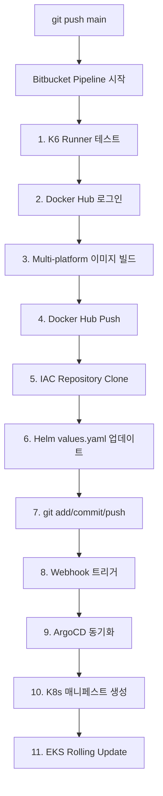

# K6 Testing Platform CI/CD 완전 가이드

## 📋 CI/CD 프로세스 전체 흐름



## 🔧 1단계: Bitbucket 환경 변수 설정

### 필수 환경 변수 6개

| 변수명 | 값 | 설명 | 보안 설정 |
|--------|-----|------|----------|
| `DOCKER_HUB_USERNAME` | leehyeontae | Docker Hub 사용자명 | ❌ |
| `DOCKER_HUB_PASSWORD` | [액세스 토큰] | Docker Hub 토큰 | ✅ |
| `CONFIG_REPO_URL` | git@bitbucket.org:inhuman-z/local_k8s.git | IAC 저장소 URL | ❌ |
| `CONFIG_REPO_SSH_KEY` | [Base64 인코딩된 SSH 키] | SSH 개인키 | ✅ |
| `GIT_USER_EMAIL` | your-email@example.com | Git 커밋 이메일 | ❌ |
| `GIT_USER_NAME` | CI Pipeline | Git 커밋 사용자명 | ❌ |

### 설정 방법

1. **Bitbucket 저장소 설정 이동**:
   ```
   Settings → Repository settings → Pipelines → Repository variables
   ```

2. **Docker Hub 액세스 토큰 생성**:
   - https://hub.docker.com/settings/security
   - "New Access Token" 클릭
   - 이름: `bitbucket-ci`
   - 권한: `Read & Write`
   - 생성된 토큰 복사

3. **SSH 키 Base64 인코딩** (이미 완료됨):
   ```bash
   cat ~/.ssh/id_ed25519 | base64
   ```

## 🚀 2단계: ArgoCD Webhook 설정

### 로컬 환경 (Kind + ngrok)

```bash
# 1. ngrok 설치 (Mac)
brew install ngrok

# 2. ArgoCD 서버 포트 포워딩
kubectl port-forward svc/argocd-server -n argocd 8080:443

# 3. ngrok 터널 생성
ngrok http 8080

# 4. ngrok URL 복사 (예: https://abc123.ngrok.io)
```

### Bitbucket Webhook 설정

1. **local_k8s 저장소로 이동**:
   ```
   https://bitbucket.org/inhuman-z/local_k8s
   ```

2. **Webhook 추가**:
   ```
   Settings → Webhooks → Add webhook
   ```

3. **설정값**:
   - **Title**: ArgoCD Sync
   - **URL**: 
     - 로컬: `https://[ngrok-url]/api/webhook`
     - AWS: `https://[argocd-domain]/api/webhook`
   - **Triggers**: Push 선택
   - **Branch**: main
   - **Active**: ✅

4. **ArgoCD Webhook Secret 생성** (선택사항):
   ```bash
   # Webhook secret 생성
   kubectl -n argocd create secret generic argocd-webhook-secret \
     --from-literal=bitbucket.webhook.secret=your-secret-key
   ```

## 📊 3단계: Pipeline 실행 및 모니터링

### Pipeline 트리거

```bash
# 코드 변경 후 main 브랜치에 푸시
git add .
git commit -m "feat: 새 기능 추가"
git push origin main
```

### Pipeline 단계별 동작

#### 1️⃣ **K6 Runner 테스트** (약 2-3분)
```yaml
- cd apps/k6-runner-v2
- npm ci
- npm run lint
- npm test
```

#### 2️⃣ **Docker 이미지 빌드 및 푸시** (약 5-10분)
```yaml
# Docker Hub 로그인
- echo $DOCKER_HUB_PASSWORD | docker login -u $DOCKER_HUB_USERNAME

# Multi-platform 빌드 (arm64, amd64)
- docker buildx build --platform linux/amd64,linux/arm64
  
# 3개 이미지 푸시:
# - control-panel
# - k6-runner
# - mock-server
```

#### 3️⃣ **IAC Repository 업데이트** (약 1-2분)
```yaml
# IAC 저장소 클론
- git clone $CONFIG_REPO_URL

# Helm values 업데이트
- yq eval -i ".image.tag = \"$GIT_COMMIT\"" values.yaml

# Git 커밋 & 푸시
- git add .
- git commit -m "Update By CI/CD at $CURRENT_DATE"
- git push origin main  # → Webhook 트리거!
```

## 🔄 4단계: ArgoCD 동기화

### ArgoCD 동작 과정

1. **Webhook 수신**:
   - Bitbucket에서 push 이벤트 전송
   - ArgoCD가 webhook 수신

2. **변경 감지**:
   ```bash
   # ArgoCD가 Git 저장소 폴링
   argocd app diff k6-runner
   argocd app diff control-panel
   argocd app diff mock-server
   ```

3. **매니페스트 생성**:
   - Helm Chart + values.yaml → K8s 매니페스트
   - 메모리에서 생성 (Git에 푸시하지 않음)

4. **동기화**:
   ```bash
   # 자동 동기화 설정된 경우
   argocd app sync k6-runner --prune
   argocd app sync control-panel --prune
   argocd app sync mock-server --prune
   ```

### ArgoCD 모니터링

```bash
# ArgoCD UI 접속
kubectl port-forward svc/argocd-server -n argocd 8080:443
# https://localhost:8080

# CLI로 상태 확인
argocd app list
argocd app get k6-runner
argocd app get control-panel
argocd app get mock-server

# 동기화 상태 확인
kubectl get applications -n argocd
```

## 🔍 5단계: 검증 및 모니터링

### 배포 상태 확인

```bash
# Pod 상태 확인
kubectl get pods -n k6-platform

# 이미지 태그 확인
kubectl describe deployment control-panel -n k6-platform | grep Image
kubectl describe deployment k6-runner -n k6-platform | grep Image
kubectl describe deployment mock-server -n k6-platform | grep Image

# Rolling Update 진행 상황
kubectl rollout status deployment/control-panel -n k6-platform
kubectl rollout status deployment/k6-runner -n k6-platform
kubectl rollout status deployment/mock-server -n k6-platform
```

### 로그 확인

```bash
# Pipeline 로그
# Bitbucket → Pipelines → 해당 실행 클릭

# ArgoCD 로그
kubectl logs -n argocd deploy/argocd-server
kubectl logs -n argocd deploy/argocd-repo-server

# 애플리케이션 로그
kubectl logs -n k6-platform -l app=control-panel
kubectl logs -n k6-platform -l app=k6-runner
kubectl logs -n k6-platform -l app=mock-server
```

## ⚠️ 트러블슈팅

### 일반적인 문제 해결

| 문제 | 원인 | 해결 방법 |
|------|------|-----------|
| Pipeline 실패: Permission denied | SSH 키 문제 | CONFIG_REPO_SSH_KEY 확인 |
| Docker push 실패 | 토큰 문제 | Docker Hub 토큰 재생성 |
| ArgoCD 동기화 안됨 | Webhook 문제 | ngrok URL 업데이트 |
| Pod ImagePullBackOff | 이미지 없음 | Docker Hub 이미지 확인 |
| Helm 업데이트 안됨 | yq 경로 문제 | values.yaml 경로 확인 |

### 디버깅 명령어

```bash
# Pipeline 환경 변수 확인
echo $CONFIG_REPO_URL
echo $DOCKER_HUB_USERNAME

# SSH 연결 테스트
ssh -T git@bitbucket.org

# ArgoCD 수동 동기화
argocd app sync k6-runner --force

# Webhook 테스트
curl -X POST https://[ngrok-url]/api/webhook \
  -H "Content-Type: application/json" \
  -d '{"repository": {"full_name": "inhuman-z/local_k8s"}}'
```

## 📅 예상 소요 시간

| 단계 | 소요 시간 |
|------|-----------|
| K6 테스트 | 2-3분 |
| Docker 빌드/푸시 | 5-10분 |
| IAC 업데이트 | 1-2분 |
| ArgoCD 동기화 | 30초-1분 |
| K8s Rolling Update | 2-5분 |
| **총 소요 시간** | **10-20분** |

## ✅ 체크리스트

- [ ] Bitbucket 환경 변수 6개 설정 완료
- [ ] Docker Hub 액세스 토큰 생성 완료
- [ ] SSH 키 Bitbucket에 등록 완료
- [ ] local_k8s 저장소 Access Key 설정 완료
- [ ] ArgoCD 설치 및 Application 생성 완료
- [ ] Webhook 설정 완료 (로컬: ngrok, AWS: 직접)
- [ ] 첫 번째 배포 테스트 완료

## 🎯 다음 단계

1. **로컬 테스트 완료 후**:
   - AWS EKS 클러스터 접근 권한 요청
   - Production ArgoCD URL로 webhook 변경
   - Production 환경 변수 설정

2. **모니터링 강화**:
   - Grafana 대시보드 설정
   - Alert 규칙 설정
   - 로그 수집 설정

3. **보안 강화**:
   - ArgoCD RBAC 설정
   - Webhook Secret 설정
   - Network Policy 설정